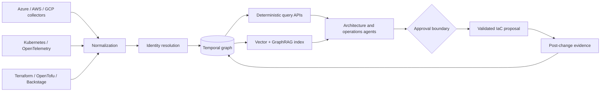

# Cloud Infrastructure Knowledge Graph

## CloudGraph

**Multi-cloud infrastructure knowledge graph and digital twin for Azure, AWS, GCP, Kubernetes, Terraform/OpenTofu, OpenTelemetry, FinOps, AIOps and cloud architecture.**

CloudGraph connects business services, applications, workloads, cloud resources, network paths, identities, costs, telemetry, owners and Infrastructure as Code in one evidence-backed graph. It provides deterministic operational context for architects, platform teams, SRE, FinOps and AI agents.

```text
Cloud APIs + Kubernetes + IaC + CMDB + telemetry + billing
                              ↓
                identity resolution + normalization
                              ↓
                 temporal infrastructure graph
                              ↓
       impact + cost + drift + ownership + evidence queries
                              ↓
          architecture, incident and controlled-change workflows
```

> **Claim boundary:** v0.1 analyzes versioned offline JSON snapshots. The included Azure/AKS commerce topology is synthetic. No cloud account, Kubernetes cluster, CMDB or production telemetry is queried; no infrastructure is changed. Graph reachability indicates potential exposure and does not prove incident causality. Revenue and cost values are modeled fixtures, not customer outcomes.

## Run it

No external runtime dependency is required.

```bash
python3 -m unittest discover -s tests -v
python3 -m cloudgraph.cli examples/azure-aks-commerce-snapshot.json \
  --failed-node azure:private-dns-postgres \
  --output generated
```

Generated outputs:

- `analysis.json` — machine-readable impact, cost, drift and KPI results;
- `evidence-report.md` — executive and engineering evidence summary;
- `topology.md` — deterministic Mermaid representation of the observed graph.

## Reference result

The synthetic scenario models a checkout service running on AKS and depending on Azure Database for PostgreSQL through Private Endpoint and Private DNS. Starting at the private DNS node, CloudGraph traces the observed dependency path to the checkout business service and identifies:

- `$420,000` of modeled monthly revenue exposure;
- the teams to engage;
- a Kubernetes declared-versus-observed replica drift;
- an unowned Private Endpoint;
- an orphaned managed disk and `$96/month` of unallocated cost;
- service-level cost allocation across observed dependencies.

These results prove deterministic graph behavior against the fixture—not a live incident or realized financial impact.

## Implemented foundation

- typed node and edge contracts;
- stable cross-source identifiers and collision rejection;
- duplicate-edge suppression;
- bounded incoming, outgoing and bidirectional traversal;
- business-service blast-radius analysis;
- graph-based cloud-cost allocation;
- declared-versus-observed drift detection;
- missing-owner and orphan detection;
- graph freshness and coverage KPIs;
- deterministic SHA-256 evidence digest;
- Mermaid topology and evidence-report generation;
- seven automated tests and CI artifact retention.

## Architecture



Graph algorithms—not language models—own reachability, cost allocation, identity resolution and evidence integrity. Models may translate questions, explain results and propose investigations, but source references and calculated paths remain inspectable.

## High-value workflows

### Change-impact intelligence

Map a Terraform or OpenTofu plan to the graph and identify affected workloads, network paths, identities, owners, SLOs, costs and business capabilities before approval.

### Incident blast radius

Start with an alerting resource, traverse observed dependencies and produce an investigation scope. The result is evidence for prioritization, not automatic causal attribution.

### Cloud migration discovery

Group applications into migration waves using runtime, data, network and ownership dependencies. Feed alternatives into the [Agentic Cloud Solution Engineering Factory](https://github.com/AAH20/agentic-cloud-solution-engineering-factory).

### FinOps allocation

Allocate invoices and OpenCost observations through infrastructure relationships to applications, teams and business services. Reconcile modeled allocation with finance-approved rules before chargeback.

### Architecture drift

Compare IaC, CMDB and diagrams with observed cloud and cluster state; identify ownership gaps and route reviewable corrections through GitOps.

## Compounding platform

```text
CloudGraph observes and connects reality
             ↓
Solution Engineering Factory designs options
             ↓
Multi-Cloud Control Loop evaluates changes
             ↓
Kubernetes AI Agent Operator isolates validation
             ↓
CloudGraph verifies the resulting state
```

Each verified workflow can become a reusable evaluation case, connector test and estimate-calibration input, subject to customer consent and data governance.

## Production roadmap

- Azure Resource Graph, AWS Config and GCP Cloud Asset Inventory collectors;
- Kubernetes informers, Terraform/OpenTofu and Backstage ingestion;
- OpenTelemetry service-graph and OpenCost integration;
- PostgreSQL with Apache AGE plus Neo4j adapters;
- OpenCypher query API and MCP server;
- temporal state, change replay and provenance;
- tenant-scoped authorization with OPA or Cedar;
- Helm chart, GitHub Action and Backstage plugin;
- signed receipts and external evidence storage;
- continuously evaluated GraphRAG explanations.

See [production architecture](docs/architecture.md), [ontology and identity](docs/ontology.md), [unit economics](docs/unit-economics.md) and [distribution roadmap](docs/distribution.md).

## KPIs

| KPI | Meaning |
|---|---|
| Graph freshness | Age of the newest required source observation |
| Identity collision rate | Conflicting entities per ingestion batch |
| Dependency precision/recall | Validated edges compared with known topology |
| Owner coverage | Graph entities connected to an accountable owner |
| Cost allocation coverage | Spend assigned under finance-approved rules |
| Time to first useful query | Install to an actionable result |
| Blast-radius investigation time | Alert to reviewed impact scope |
| Drift detection latency | State change to surfaced mismatch |
| Change mapping coverage | Plan resources resolved to graph entities |
| Post-change verification rate | Approved changes with observed outcome evidence |
| Connector adoption | Active source integrations per deployment |
| Cost per million relationships | Storage and processing unit economics |

## OSS distribution

The complete local workflow remains open and account-free. Planned distribution surfaces include PyPI, GHCR, Docker Compose, Helm, GitHub Actions, Backstage and MCP. Connector contracts and conformance fixtures allow contributors to add sources without coupling them to a hosted service.

Commercial extensions may provide managed collectors, enterprise SSO, historical replay, private deployment, multi-customer MSP operation, custom integrations and signed evidence custody.

## Call to action

Bring an infrastructure snapshot, migration estate or incident dependency question. We can turn fragmented operational records into an evidence-backed topology and measurable architecture decision. [Request a CloudGraph architecture review](https://a2zsoc.com/contact?topic=cloud-infrastructure-knowledge-graph&utm_source=github&utm_medium=repository).

## License

Apache-2.0.
